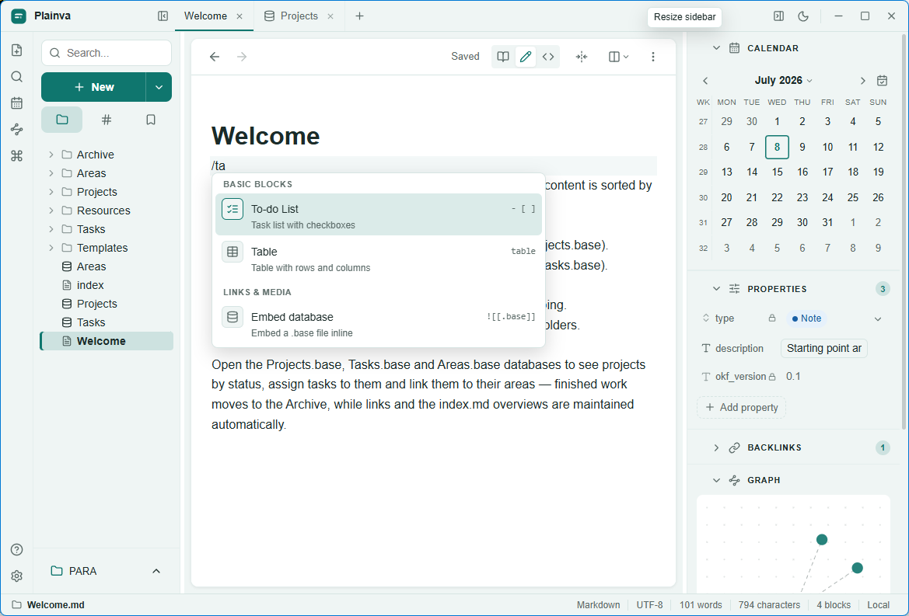
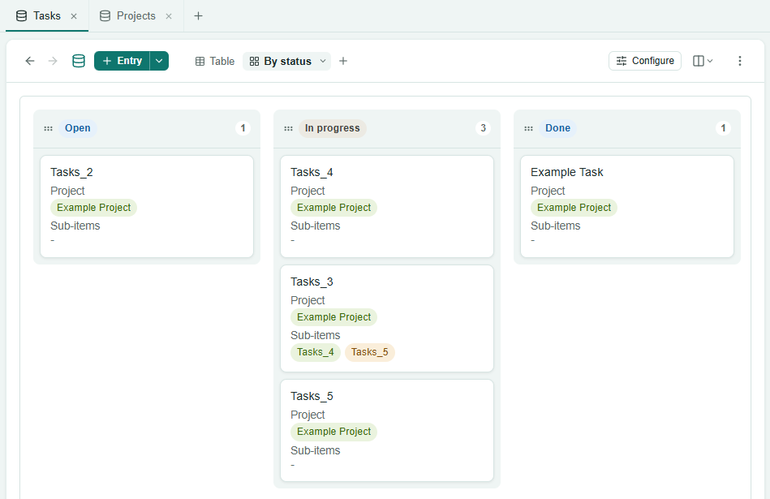
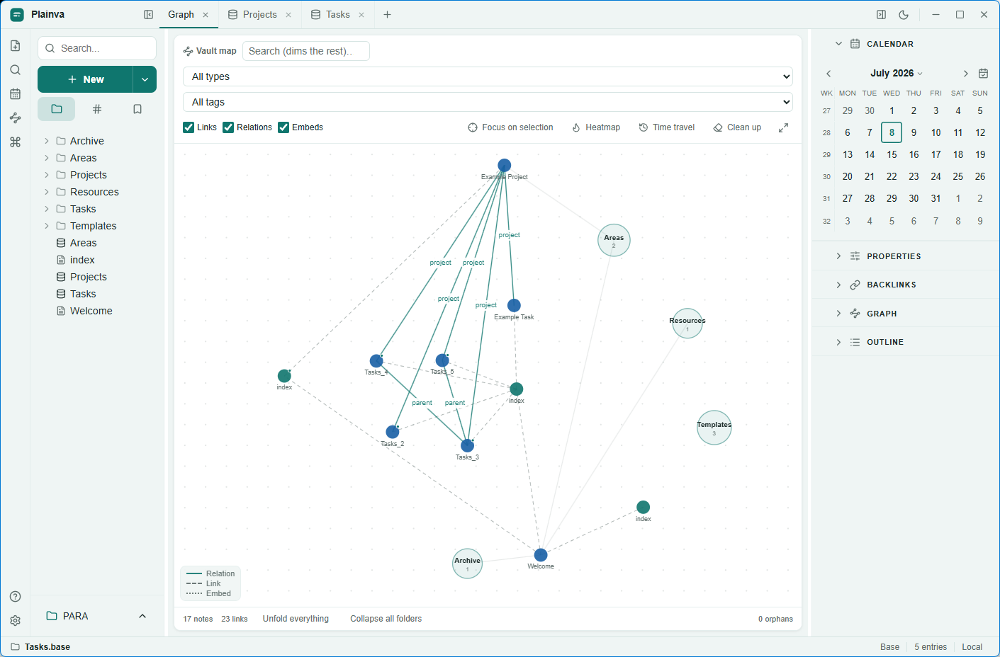

# Plainva

[](https://github.com/plainva/plainva/actions/workflows/ci.yml)
[](LICENSE)

**Your notes are plain Markdown files in a folder you own. Plainva makes them feel like a modern app — without ever locking you in.**

Plainva is an open-source, local-first Markdown vault editor for Windows, macOS and Linux. It opens existing Obsidian vaults without migration, adds Notion-style databases over plain files, syncs through YOUR storage — and every file it writes stays readable in any text editor, forever.

> **Status: Beta.** Plainva is used daily on real vaults, ships with an extensive test suite (1,500+ tests) and automatic per-file versioning — but it is pre-1.0 software. Keep backups of irreplaceable vaults (Plainva also creates daily ZIP backups by default).

<!-- Add the three PNGs under docs/assets/ before the public push (see docs/assets/SCREENSHOTS.md). -->


<p align="center">
  
  
</p>

## Highlights

- **Real Markdown editor** — live preview (Obsidian- or Notion-style syntax display), slash menu, tables with inline cell editing, callouts, wiki links with fuzzy autocomplete, block drag handles, math (KaTeX), Mermaid diagrams, footnotes, clickable task checkboxes in read mode, print/PDF export.
- **Databases over plain notes (`.base`)** — tables, boards, calendars, galleries, timelines and a graph view over your notes' frontmatter, including relations with computed reverse columns. The data IS your notes; the `.base` format stays Obsidian-compatible.
- **Graph** — a context graph beside every note, a semantic-zoom vault map with cleanup tools (orphans, broken links, unlinked mentions) and time travel.
- **Sync through your storage** — WebDAV/Nextcloud, S3-compatible object storage (R2, MinIO, B2, …), Google Drive, OneDrive and Dropbox. Offline queue, 3-way merge, a visual conflict resolver, and nothing ever leaves your chosen storage. Credentials live in the OS keychain.
- **Versioning built in** — every write is snapshotted locally; browse, diff and restore any version, recover deleted files, daily ZIP backups.
- **Fast on large vaults** — SQLite/FTS5 full-text search as you type, incremental indexing, a measured performance budget (see `docs/engineering/Performance_Notes.md`).
- **Yours** — 10 UI languages, 13+ themes (including a few delightful secrets), no telemetry, no account, AGPL-licensed.

## Obsidian compatibility

Plainva follows a strict rule: **every file it writes must still open in Obsidian.** Notes are standard Markdown + YAML frontmatter; Plainva-specific presentation lives under a single namespaced `plainva:` key that other tools simply ignore. Existing vaults are never migrated or reformatted. The optional [OKF conventions](docs/user/en/OKF.md) (typed notes, managed `index.md` files) are opt-in.

Note that the guarantee runs one way: Obsidian can always **open** what Plainva writes, but once a vault uses Plainva features (`.base` extensions such as boards or relations, managed `index.md` files), **editing** those specific files in Obsidian can break that functionality — Obsidian does not know the `plainva:` extensions. Notes without Plainva extensions can be edited anywhere, anytime. Details in the [FAQ](docs/user/en/FAQ.md#can-i-use-plainva-and-obsidian-side-by-side).

## Automation & scripting

Plainva has no code-plugin sandbox — the vault *is* the interface. Every file is plain Markdown or YAML with an open, documented format, so any script, CLI tool or AI agent can read and write your vault directly and safely, with no Plainva-specific API to learn. See the guide's [Automation & Scripts](docs/user/en/Automation_and_Scripts.md) page and the machine-oriented [file format reference](docs/user/en/File_Format_Reference.md). (A dedicated in-app plugin system remains a separate post-1.0 idea.)

## Download & install

Grab the installer for your platform from the [Releases page](https://github.com/plainva/plainva/releases). Updates are delivered in-app (signed, with an opt-out).

Cloud providers: WebDAV/Nextcloud, S3, OneDrive and Dropbox work out of the box. Only Google Drive currently requires a free app registration of your own ("bring your own client ID") — the settings link a step-by-step guide, and the [user guide](docs/user/en/Sync_Setup.md) covers every provider.

## User guide

A multilingual handbook lives in [`docs/user/`](docs/user/README.md): **[Deutsch](docs/user/de/README.md)** | **[English](docs/user/en/README.md)** | **[Français](docs/user/fr/README.md)** | **[Español](docs/user/es/README.md)** | **[Português (Brasil)](docs/user/pt-BR/README.md)** | **[Italiano](docs/user/it/README.md)** | **[Nederlands](docs/user/nl/README.md)** | **[Polski](docs/user/pl/README.md)** | **[简体中文](docs/user/zh-CN/README.md)** | **[日本語](docs/user/ja/README.md)**

It covers getting started, notes & Markdown, `.base` databases, sync per provider, search, backups & versioning, the graph, keyboard shortcuts, an FAQ — and a machine-oriented [file format reference](docs/user/en/File_Format_Reference.md) so scripts and AI tools can work on your vault correctly. Languages other than German and English are machine-translated; corrections welcome.

## Roadmap (excerpt)

Mobile apps, end-to-end encryption for synced vaults, a plugin system and real-time collaboration are planned post-1.0 — staging and priorities are tracked in GitHub Issues and Discussions. No feature will ever compromise the plain-Markdown rule.

## Building from source

Requirements: Git, Node.js ≥ 22, pnpm 10 (`npm i -g pnpm@10.0.0`), and for the native app Rust/Cargo plus the [Tauri prerequisites](https://tauri.app/start/prerequisites/).

```bash
git clone https://github.com/plainva/plainva.git
cd plainva
pnpm install --frozen-lockfile

pnpm --filter desktop tauri dev     # run the desktop app
pnpm test && pnpm lint && pnpm typecheck   # checks
pnpm --filter desktop test:e2e      # Playwright E2E (Vite dev server)
pnpm --filter desktop smoke:prod    # production-build smoke (vite build + preview + boot check)
```

The repo is a pnpm/Turborepo monorepo: `apps/desktop` (Tauri v2 + React + CodeMirror 6), `packages/core` (vault logic: indexing, sync, merge — UI-free and heavily unit-tested), `docs/` (user guide, ADRs, engineering notes).

## Contributing

Issues and pull requests are welcome — please read [CONTRIBUTING.md](CONTRIBUTING.md) first (tests, the 10-language locale rule, the Obsidian-compatibility rule) and sign the [CLA](CLA.md) on your first PR. Security issues go through [SECURITY.md](SECURITY.md), never public issues.

## License

[AGPL-3.0-only](LICENSE). Your vault content is yours; Plainva never phones home.
