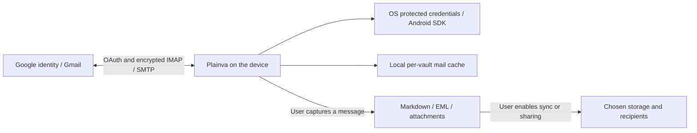

# Native Google mail

Status: implemented behind explicit native test-client configuration; registration, live consent and provider verification are not claimed. Updated 2026-09-14.

Gmail uses the existing reader, compose window, capture actions and account registry. `kind: "gmail"` selects IMAP/SMTP with XOAUTH2. Historical `kind: "imap"` accounts retain their app-password login. Connecting Gmail OAuth does not convert password accounts. A confirmed account can add files or calendars while preserving narrower grants. See [account grants](Account_Grants.md).

## Native registration

| Platform | Registration and return | Renewal |
| --- | --- | --- |
| Windows, macOS, Linux | Desktop client; system browser, PKCE S256, random state and ephemeral loopback listener | Device-local refresh token through the broker |
| iOS | iOS client, bundle `com.plainva.app`; browser return `com.plainva.app:/oauth2redirect`, PKCE S256 and state | Protected refresh token and durable received-consent record |
| Android, a user's own project | iOS-type client, bundle `com.plainva.app`; browser return `com.plainva.app:/oauth2redirect` (the manifest's scheme filter), PKCE S256 and state - the same flow and code as iOS | Protected refresh token and durable received-consent record |
| Android, the one project that owns the build | Android client, package `com.plainva.app` + the Play app-signing SHA-1; Play services `AuthorizationClient` (play-services-auth 22.0.0) | Play services owns renewal; Plainva stores verified identity and actual scopes, without a fabricated refresh token |

**Why Android has two ways (finding 2026-10-09).** Play services identifies the installed app through package name and signing certificate, and Google lets that pair be registered in exactly one Cloud project: creating an Android client for `com.plainva.app` with the Play app-signing SHA-1 in a second project is refused with "Die Anfrage ist fehlgeschlagen, da der Android-Paketname und der Fingerabdruck bereits verwendet werden" (the request failed because the Android package name and fingerprint are already in use). So the system sign-in can serve one project in the world - and, while that project's consent screen is in testing, only its test users. From 0.8.3 to 0.8.4 it was nevertheless the only Google sign-in on Android, which left every other user without one; the user guide even told them to register package and SHA-1. Before 0.8.3 Android signed in through the browser with an Android-type client and the custom-scheme return, where Google does not check the fingerprint - which is why a client with a wrong SHA-1 worked then and stopped working with the system sign-in. The rule now (`chooseGoogleSignInFlow` in `packages/ui/src/lib/googleAuthorization.ts`, for calendar, Drive and Gmail): a client ID the user entered signs in through the browser, exactly as on iOS. Play services is used only with the client the build ships (`VITE_PLAINVA_GOOGLE_ANDROID_CLIENT_ID`, gated by `googlePublicClient.ts`) and to sign in again an account that already holds a Play-services grant made with the same client; such accounts keep renewing through Play services and are never moved or re-prompted. A new connection is not offered a client ID that stems only from a Play-services grant. A user's own project uses an iOS-type client on Android as well: it is the installed-app client type whose custom-scheme return Google documents, it has no secret, and its bundle ID is not subject to the package-and-fingerprint uniqueness. An Android-type client is not an option (the uniqueness above; custom URI schemes are also off by default there), a Desktop client only allows a loopback return, and a Web client would need a hosted return page and a secret. Not verified against a live Google project from this repository: that Google accepts an iOS-type client from an Android browser. With the system sign-in, background access never opens consent and a rejected access token is cleared from the SDK cache before renewal. Desktop client values belong to an installed application, not a confidential web backend. [Google native OAuth](https://developers.google.com/identity/protocols/oauth2/native-app), [Android authorization](https://developer.android.com/identity/authorization).

A failed system sign-in names its class. The plugin (`GoogleAuthorizationPlugin`) reads the activity result's intent whatever the result code is, because a refused request ends "cancelled" with a status that says why, and rejects with a stable code: `CANCELLED` only for a closed sheet (no intent, or status 16), `DEVELOPER_ERROR` (10) when Google does not know this package and certificate, `NETWORK_ERROR`/`TIMEOUT`, `SIGN_IN_REQUIRED`/`INVALID_ACCOUNT`, `INTERNAL_ERROR`, `PLAY_SERVICES_UNAVAILABLE`, `INTERRUPTED`, otherwise `AUTH_FAILED` with the status number. `packages/ui/src/lib/googleAuthorization.ts` turns the code into the user's sentence and into one diagnostics line under the source `google-signin` (services, interactive or background, stage, status, result code, whether an intent came back) - never an address, a scope or a token. The sentence for `DEVELOPER_ERROR` says that the system sign-in is not available for this installation and points to the browser sign-in with an own client ID; it does not ask anyone to register the build. A background renewal logs a repeated failure once.

## Test configuration

No client IDs are shipped by this change. `googlePublicClient.ts` exposes the entry only when required values exist and `VITE_PLAINVA_GOOGLE_MAIL_STATE=testing`. Other states, including `production`, keep it hidden. The button and notice explicitly describe test access.

| Input | Meaning |
| --- | --- |
| `VITE_PLAINVA_GOOGLE_MAIL_STATE` | `testing` for the registered test client |
| `VITE_PLAINVA_GOOGLE_DESKTOP_CLIENT_ID` | Desktop client ID |
| `VITE_PLAINVA_GOOGLE_DESKTOP_CLIENT_SECRET` | Matching installed Desktop client value |
| `VITE_PLAINVA_GOOGLE_IOS_CLIENT_ID` | iOS client ID |
| `VITE_PLAINVA_GOOGLE_ANDROID_CLIENT_ID` | Android client ID of the one project that holds package and Play app-signing certificate; the only client the system sign-in is offered with |

For local builds use the shell's ignored `.env.local` or its build environment; never commit a populated environment file. Mobile workflows accept state and platform client ID as repository variables. Unset values leave the entry disabled. Build-cache inputs include these values. Production activation requires registration, reviewed disclosure, provider decision and a separate source change.

## Permissions and data

IMAP/SMTP requires `https://mail.google.com/`; `openid email` supports verified account matching. Plainva checks the returned scope and authenticated user-info response, then probes IMAP. Narrow Gmail API scopes cannot authorize this protocol connection. Google's Gmail API guidance also requires justification for this broad scope, including permanent-deletion functionality. Submission must show actual actions and protocol; protocol choice alone does not establish approval. [XOAUTH2](https://developers.google.com/workspace/gmail/imap/xoauth2-protocol), [Gmail scopes](https://developers.google.com/workspace/gmail/api/auth/scopes).

The HTTP bridge is embedded in the installed app. No Plainva mail proxy, token server or Gmail indexing service is introduced. Offline reading stores envelopes and recently viewed bodies in the per-vault index (`mailCache.ts`, up to 200 bodies). Compose and the send-delay queue hold outgoing content. Sending transfers it through Gmail to addressed recipients. Loading external images remains a separate user choice and can contact sender-controlled hosts.

Capture writes Markdown or raw EML through the vault adapter; attachments can be saved as files. These follow the vault's storage, backup, export, publication, sharing and sync settings. Removing an account does not erase intentionally captured notes or copies already held by recipients. Users can also revoke access in Google account settings. OAuth credentials and Android renewal metadata are installation-local, excluded from profiles and the credentials sideband. Existing optional password sync remains separate for password accounts.

Restricted-data assessment must consider user-selected server destinations too. No exemption is inferred from local authentication or absence of a Plainva backend. Published disclosure and submission must describe access, storage, sharing and retention consistently. [Restricted-scope verification](https://developers.google.com/identity/protocols/oauth2/production-readiness/restricted-scope-verification), [User-data policy](https://developers.google.com/terms/api-services-user-data-policy).

## Failure boundaries

Batch mutations, UID verification and attachment metadata use the shared [mail action contract](Mail_Batch_Actions.md).

The broker selects by account, client and service, checks scopes after renewal and protects credential changes with compare-and-set. Wrong identity, incomplete consent and cancellation preserve existing access. Stable Gmail connection IDs allow retry after an interrupted mailbox/registry write. Mobile received-consent records are replayable until their ten-minute expiry; expiry requires consent again without deleting existing accounts.

XOAUTH2 never falls back to a password mechanism. OAuth rejection can renew once and retry authentication; a disconnect after SMTP DATA is not automatically replayed. Google tokens are restricted to Gmail IMAP/SMTP hosts. ManageSieve is not offered for Gmail; both transports reject OAuth credentials before opening a Sieve connection. Authentication errors use a constant code, excluding reflected credentials from displayed errors.

Automated coverage includes protocol success/rejection, challenge acknowledgement, changed servers, expired grants, account isolation, interrupted storage, mobile cold return and preservation of legacy passwords. Windows Rust and Android Java compilation are distinct from live Google consent. Native iOS compilation runs in the mobile delivery workflow.
